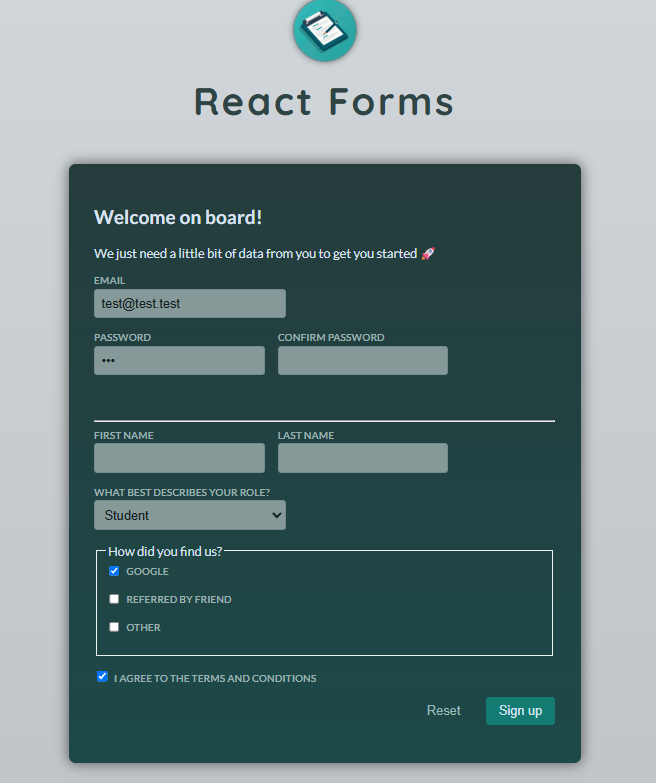
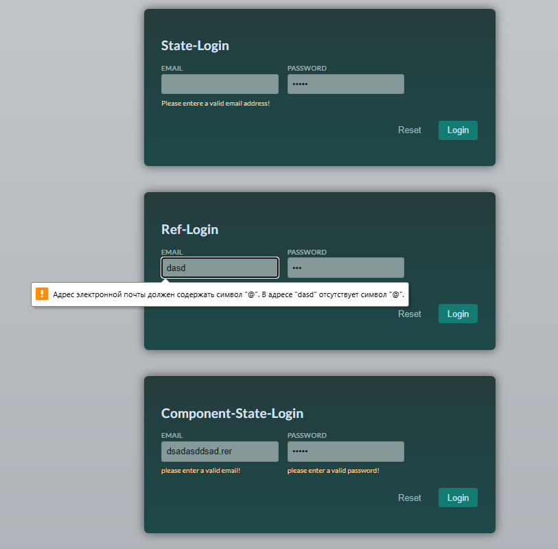

# 🧩 React Forms Learning Project

This repository is an **educational project** created to demonstrate different approaches to building and validating **forms in React**.  
It covers working with **browser APIs**, **React state**, **refs**, and **custom hooks** — providing clear and minimal examples for learning.

---

<h3 align="center">📸 Project Preview</h3>

<p align="center">
  <br/>
  <em>Example of form validation and controlled inputs</em>
</p>

<p align="center">
  <br/>
  <em>Reusable input components and validation logic in action</em>
</p>

---

## 🎯 Project Goals

The project demonstrates how to:
- Manage form input using `useState` and `useRef`.
- Validate form fields dynamically.
- Use browser tools like `FormData` for structured data handling.
- Create reusable form components with built-in error handling.
- Isolate logic into **custom hooks** (e.g. `useInput`) for cleaner state management.

---

## ⚙️ Core Concepts

| Concept | Description |
|----------|--------------|
| **Refs** | Direct access to DOM inputs via `useRef()` |
| **Component State** | Controlled inputs managed with `useState()` |
| **FormData API** | Efficient extraction of form values |
| **Validation** | Dynamic input validation via simple helper functions |
| **Custom Hooks** | Logic abstraction using `useInput()` |
| **Reusability** | Generic `<Input />` component for consistent form structure |

---

## 🧠 Validation Logic Example

- `required` attribute ensures non-empty fields  
- `minLength={6}` enforces basic password strength  
- Simple helpers for readability:
  ```js
  export function isEmail(value) { return value.includes('@'); }
  export function hasMinLength(value, min) { return value.length >= min; }
```
## Example Code (simplified)
```js
import { useState, useRef } from "react";

export default function FormExample() {
  const email = useRef();
  const [values, setValues] = useState({ email: "", password: "" });

  function handleSubmit(event) {
    event.preventDefault();
    const fd = new FormData(event.target);
    console.log(Object.fromEntries(fd.entries()));
  }

  return (
    <form onSubmit={handleSubmit}>
      <label>Email</label>
      <input id="email" type="email" ref={email} required />
      <label>Password</label>
      <input type="password" minLength={6} required />
      <button>Submit</button>
    </form>
  );
}
```
